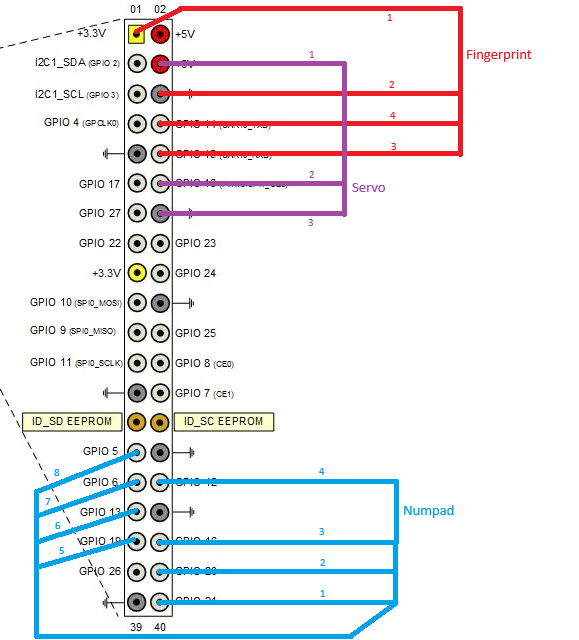

# Fingerprint and Face Recognition based Door Lock System

## About
This project is a comprehensive door lock system that utilizes multiple authentication methods: fingerprint recognition, facial recognition, and a PIN code. Built on a Raspberry Pi platform, this system provides triple-layer security for controlling physical access to a door or secure area. The project uses a servo motor to simulate the door lock opening and closing mechanism.


## Hardware Requirements

| Component | Specification Used | Description |
|-----------|-------------------|-------------|
| Raspberry Pi | Raspberry Pi 5 | Main processing unit |
| Power Supply | Raspberry Pi Adaptor | Power source |
| Keypad | 4x4 Matrix Keypad | PIN code entry |
| Camera Module | 5MP v1.3 | Facial recognition |
| Fingerprint Sensor | R307 Fingerprint Sensor | Biometric authentication |
| Servo Motor | SG90 Servo | Door lock mechanism |
| Jumper Wires | 20x Male-Female | To connect to GPIO pins |
| MicroSD Card | SanDisk Extreme A2 64 GB | Storage for Raspberry Pi OS |

### Optional Components

| Component | Specification Used | Description |
|-----------|-------------------|-------------|
| Monitor | HDMI Monitor | Display for Raspberry Pi |
| HDMI Cable | Micro-HDMI to Monitor | Video output for Raspberry Pi |
| Keyboard | USB Keyboard | Input device for Raspberry Pi |
| Mouse | USB Mouse | Input device for Raspberry Pi |

## Connection Diagram

<div style="display: flex; justify-content: space-between;">
    
    
</div>

## Installation and Setup

### 1. Install Required Libraries
```bash
pip install adafruit-fingerprint
pip install face_recognition
pip install opencv-python
pip install picamera2
pip install gpiozero
pip install imutils
pip install numpy
```

### 2. Register Fingerprints
Run the fingerprint enrollment script to register your fingerprints:
```bash
cd fingerprint
python edit_sensor.py
```
Follow the on-screen prompts to enroll your fingerprints.

### 3. Capture Face Images
Change the name in the `image_capture.py` script to your name:
```bash
cd face_recognition_folder
# Edit PERSON_NAME variable in image_capture.py
python image_capture.py
```
Take multiple photos of your face from different angles when prompted.

### 4. Train Facial Recognition Model
```bash
cd face_recognition_folder
python model_training.py
```

### 5. Configure PIN Code
Edit the default PIN code (1234) in `numpad/password_input.py`:
```python
self.password = ["1", "2", "3", "4"]  # Change this to your preferred PIN
```

### 6. Run the System
```bash
python main.py
```

## Usage
1. Enter your PIN code on the keypad
2. Look at the camera for facial recognition
3. Place your finger on the fingerprint sensor
4. If all authentication methods pass, the door will unlock

## Documentation References
- [Face Recognition with Raspberry Pi and OpenCV](https://core-electronics.com.au/guides/raspberry-pi/face-recognition-with-raspberry-pi-and-opencv/)
- [Adafruit Optical Fingerprint Sensor Guide](https://learn.adafruit.com/adafruit-optical-fingerprint-sensor/circuitpython)
- [Control Servo with Raspberry Pi](https://core-electronics.com.au/guides/control-servo-raspberry-pi/)
- [Fingerprint Scanner with Raspberry Pi](https://core-electronics.com.au/guides/raspberry-pi/fingerprint-scanner-raspberry-pi/)